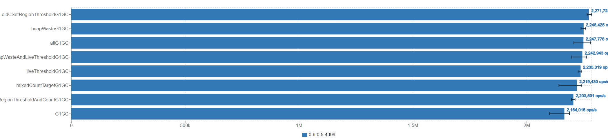
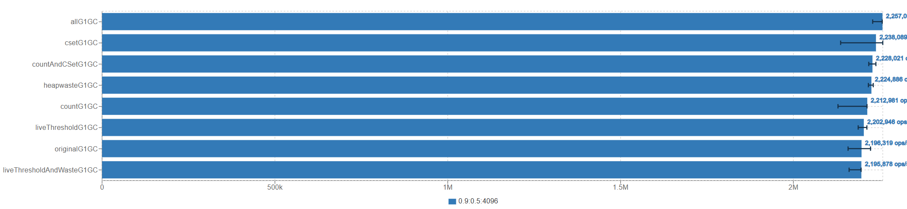
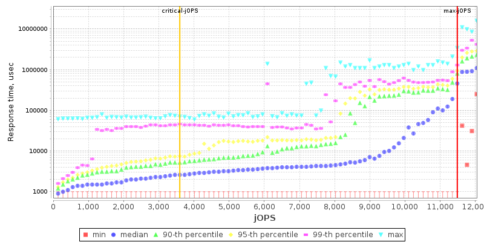
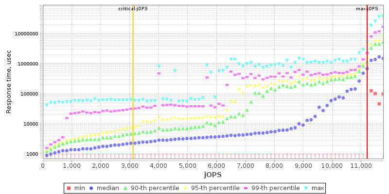

# Kona JDK GC分析-任务三
## 一. 任务
优化一些mixed GC的参数的数值，使其能够根据Java进程的运行状态同样的进行动态调整。（见[JDK-8159697](https://bugs.openjdk.org/browse/JDK-8159697))

## 二. 任务分析

Mixed GC中，主要包含4个参数可供调节，分别是：

1. G1MixedGCLiveThresholdPercent ： region中live bytes超过该值将不会被回收。
```
其中CollectionSetChooser的逻辑为：
bool G1CollectionSetChooser::should_add(HeapRegion* hr) {
  return !hr->is_young() &&
         !hr->is_pinned() &&
         region_occupancy_low_enough_for_evac(hr->live_bytes()) &&
         hr->rem_set()->is_complete();
}

region_occupancy_low_enough_for_evac的逻辑为 live_bytes < mixed_gc_live_threshold_bytes();

```

2. G1OldCSetRegionThresholdPercent ： 决定old_region_length的上限

3. G1MixedGCCountTarget ： 期望mixed GC的次数,决定old_region_length的下限（理想情况下）


即，针对CSet来说，
它的下限为[the size of collection set /G1MixedGCCountTarget ](https://github.com/Tencent/TencentKona-17/blob/TencentKona-17.0.11/src/hotspot/share/gc/g1/g1Policy.cpp#L1267)

它的上限为[heap region number * G1OldCSetRegionThresholdPercent / 100](https://github.com/Tencent/TencentKona-17/blob/TencentKona-17.0.11/src/hotspot/share/gc/g1/g1Policy.cpp#L1275)

因为G1会控制每个GC Pause Time，所以[G1Policy::calculate_old_collection_set_regions](https://github.com/Tencent/TencentKona-17/blob/TencentKona-17.0.11/src/hotspot/share/gc/g1/g1Policy.cpp#L1292)计算的old_region_length受到gc暂停时间的制约。但是Mixed GC会把collecion set尽可能多的region放入old_region_length，直到回收这些region所需的总时间接近估计的GC Pause Time。因此G1MixedGCCountTarget等参数只是软下限。

```
[196.180s][debug][gc,ergo,cset   ] GC(111) Start adding old regions to collection set. Min 109 regions, max 205 regions, time remaining 85.17ms, optional threshold 17.03ms
[196.180s][debug][gc,ergo,cset   ] GC(111) Old candidate collection set empty.
[196.180s][debug][gc,ergo,cset   ] GC(111) Added 68 initial old regions to collection set although the predicted time was too high.
[196.180s][debug][gc,ergo,cset   ] GC(111) Finish choosing collection set old regions. Initial: 89, optional: 0, predicted old time: 0.00ms, predicted optional time: 0.00ms, time remaining: 0.00
```
例如该日志可以看到，最终选择的regions小于min 109 regions，因为剩余时间不足。

4. G1HeapWastePercent ：G1堆中的浪费空间百分比，在确定CSet时，会通过G1CollectionSetChooser::prune函数根据该参数过滤掉一些收益较低的region。


根据参数含义，我认为当GC回收速度无法满足晋升速度时，针对单个参数来说，应当降低G1MixedGCCountTarget(提升CSet最小值），增加G1OldCSetRegionThresholdPercent（增大CSet最大值），降低G1HeapWastePercent，增加G1MixedGCLiveThresholdPercent（增大回收Region数量）。反之亦然。


## 三. 参数效果验证

为了检验各个参数带来的效果，这里我们通过任务一的benchmark测试了不同参数配置下的吞吐量情况。分别包括：
1. -XX:G1OldCSetRegionThresholdPercent=20
2. -XX:G1MixedGCLiveThresholdPercent=95
3. -XX:G1HeapWastePercent=3
4. -XX:G1MixedGCCountTarget=6
5. 以及部分两两组合的参数配置、及全部参数修改的情况


在Ultra 5-125H上，我们选择前8个逻辑核（即4个P核），Heap size为4G，每个iteration的时间为30s,live data fraction为0.,hit rate为0.5，测试结果如下：

效果如下：

可以发现，这些参数能够带来一定性能提升。但因为该benchmark的特性，当性能越高时，产生的垃圾也越多。


## 四. 动态调整参数的实现

根据我的分析，我们做出的假设如下：

GC回收速度应该尽可能与程序产生垃圾速度相抵消时最佳。即：

1. 当该次Mixed GC后堆内存占用大于上一次Mixed GC（或Prepare Mixed GC）后的内存占用时，说明该Mixed GC回收速度不足，应当调整上述参数以快速回收。
2. 当该次Mixed GC后堆内存占用小于上一次Mixed GC（或Prepare Mixed GC）后的内存占用时，说明该Mixed GC回收速度过快，应当调整上述参数以减少计算资源占用。

更进一步的，考虑到IHOP, 在开启下一批Mixed GC时，我们需要进行Root Mark，所以我们应尽可能的在本批Mixed GC将堆占用降低到IHOP预测的threshold以下，以尽可能避免Full gc。

综上，我们设计的逻辑为：

1. 在每次last_young_pause后计算内存占用与IHOP threshold的差值，作为本批Mixed GC的目标（distance）。
2. 统计上一次Mixed GC（或Prepare Mixed GC）后的内存占用与该次Mixed GC后堆内存占用差值，作为垃圾回收效果。
3. 当预测的垃圾回收效果 < distance/ G1MixedGCCountTarget,说明速度不足，需要调整参数以加速回收。
4. 当预测的垃圾回收效果 > distance/ G1MixedGCCountTarget,说明速度足够，需要调整参数以减少计算资源占用。

需要注意的是，由于G1MixedGCCountTarget是一个软下限，所以这个估值可能会有一定的误差。

因此，我们在每次GC后判断是否为last_young_pause或mixed_pause，如果是，则将更新相应的值。

https://github.com/icyclv/TencentKona-17/blob/AdaptMixedGC/src/hotspot/share/gc/g1/g1Policy.cpp#L806
```C++
   if(G1GCPauseTypeHelper::is_last_young_pause(this_pause)) {
      _adapt_mixed_gc_control->update_last_young_pause_info((long)_g1h->used(),(long)_ihop_control->get_conc_mark_start_threshold(_adapt_mixed_gc_control->get_heap_waste_percent()));
    }else if(G1GCPauseTypeHelper::is_mixed_pause(this_pause)) {
      _adapt_mixed_gc_control->update_allocation_info((long)_g1h->used());
    }

        
 
```

https://github.com/icyclv/TencentKona-17/blob/AdaptMixedGC/src/hotspot/share/gc/g1/g1AdaptMixedGCControl.cpp#L45
```C++
void G1AdaptMixedGCControl::update_last_young_pause_info(long used_after_gc,long ihop_target) {
    _distance_to_target = used_after_gc - ihop_target;
    _last_used_after_gc = used_after_gc; 
}
void G1AdaptMixedGCControl::update_allocation_info(long used_after_gc) {
   
    long used_since_last_gc = used_after_gc - _last_used_after_gc;
    log_debug(gc,adapt)("last used after gc: %ld, used after last gc: %ld, used since last gc: %ld", _last_used_after_gc, used_after_gc, used_since_last_gc);
    _old_gen_growth_s.add((double)used_since_last_gc);
    _last_used_after_gc = used_after_gc;
.......
}
```
当数据足够预测后，我们根据上述逻辑调整参数。这里我们选择调整的力度为5%，并且有上下界限制。这里的上下界限是根据默认参数设置[50%,150%]这类设定得到的，避免过于极端的设置出现。
```C++
 if(have_enough_data_for_prediction()) {
        double pred_old_gen_growth = predict(&_old_gen_growth_s);
        
        log_debug(gc,adapt)("predict old gen growth: %f, _distance_to_target/_mixed_gc_count_target: %f", pred_old_gen_growth, (double)(_distance_to_target/_mixed_gc_count_target));
        if((-pred_old_gen_growth) < (double)(_distance_to_target/_mixed_gc_count_target)*0.8) {
            if(_adapt_mixed_gc_count_target) {
            _mixed_gc_count_target = MAX2(_default_mixed_gc_count_target_lower_bound,_mixed_gc_count_target * 95/100);
            }
            if(_adapt_old_cset_region_threshold_percent) {
                _old_cset_region_threshold_percent = MIN2(_default_old_cset_region_threshold_percent_upper_bound,(_old_cset_region_threshold_percent * 105+99)/100);
            }
            if(_adapt_mixed_gc_live_threshold_percent) {
                _mixed_gc_live_threshold_percent = MIN2(_default_mixed_gc_live_threshold_percent_upper_bound,(_mixed_gc_live_threshold_percent * 105+99)/100);
            }
            
            if(_adapt_heap_waste_percent) {
                _heap_waste_percent = MAX2(_default_heap_waste_percent_lower_bound,_heap_waste_percent * 95/100);
            }
        }else if ((-pred_old_gen_growth) > (double)(_distance_to_target/_mixed_gc_count_target)*1.2) {
            if(_adapt_mixed_gc_count_target) {
            _mixed_gc_count_target = MIN2(_default_mixed_gc_count_target_upper_bound,(_mixed_gc_count_target * 105+99)/100);
            }
            if(_adapt_old_cset_region_threshold_percent) {
            _old_cset_region_threshold_percent = MAX2(_default_old_cset_region_threshold_percent_lower_bound,(_old_cset_region_threshold_percent * 95)/100);
            }
            if(_adapt_mixed_gc_live_threshold_percent) {
            _mixed_gc_live_threshold_percent = MAX2(_default_mixed_gc_live_threshold_percent_lower_bound,(_mixed_gc_live_threshold_percent * 95)/100);
            }
            if(_adapt_heap_waste_percent) {
            _heap_waste_percent = MIN2(_default_heap_waste_percent_upper_bound,(_heap_waste_percent * 105+99)/100);
            }
        }
            
```


另外将IHOP、CSetChooser等类中利用到这些参数的地方替换为该类中的计算得到的参数，以实现动态调整。

这里通过新增四个jvm参数控制控制是否开启4个参数动态调整。需要注意的是这里并没有分析参数之间的相互影响，所以实现是较为粗糙的。


## 五. 性能测试

我们在Ultra 5-125H上，选择前8个逻辑核（即4个P核），Heap size为4G，每个iteration的时间为30s,live data fraction为0.,hit rate为0.5，测试了开启动态调整参数的情况下的吞吐量情况。测试结果如下：



其中动态调整参数能够获得一定程度上的优化，但注意到与我们手动调整较好的参数效果仍有一定差距。此外因为该benchmark的只是简单的toy benchmark，
有很大的不稳定性，所以我们需要更多的测试来验证该方法的有效性。

为了更严谨的验证修改效果，这里我选择了SPECjbb2015，使用composite 模式，CPU为AMD EPYC 7Y43，选择12个线程（即6个物理核心，处在同一个CCD),堆内存为2G。

|JDK | max-jOPS | critical-JOPS |
|---|----------|---------------|
|AdaptMixedGC| 11485    | 3597          |
|Default| 11208    | 3119          |

效果如下图所示：

上图为AdaptMixedGC的测试结果

上图为Default的测试结果

可以发现，在SPECjbb2015中，AdaptMixedGC相对于Default有一定的性能提升，其中max-jOPS提升了2.4%，critical-JOPS提升了11.5%。


## 六. 总结

本次实验中，我们通过对Mixed GC参数的调整，实现了动态调整参数的功能。通过对benchmark的测试，我们发现这种方法能够在一定程度上提升性能。

但同时实验有很大的局限性，因为我们只是简单的通过预测的方式调整参数，而没有考虑参数之间的相互影响。因此，我们需要更多的测试来验证该方法的有效性。

此外，也缺乏针对单独参数调整更详尽的分析，因此我们需要更多的测试来验证该方法的有效性。

这些都是我们需要在后续的工作中进一步完善的地方。

## 七. Links

1. 项目地址：https://github.com/icyclv/TencentKona-17/tree/AdaptMixedGC

2. JDK-8159697： https://bugs.openjdk.org/browse/JDK-8159697