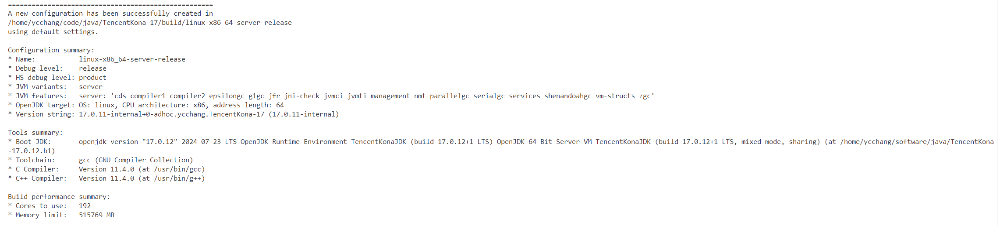
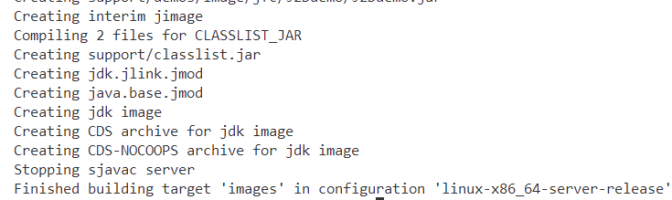
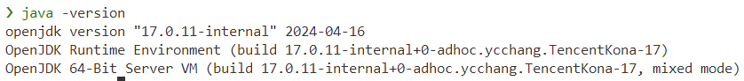
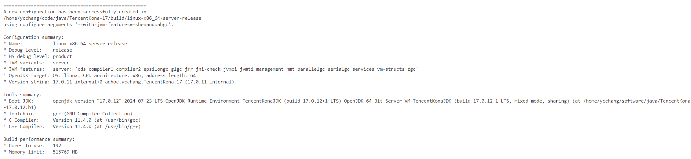
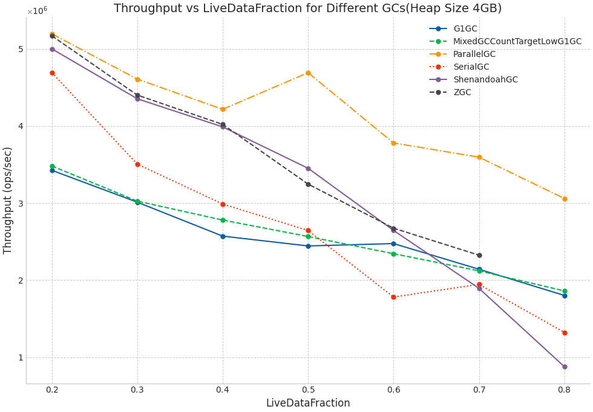
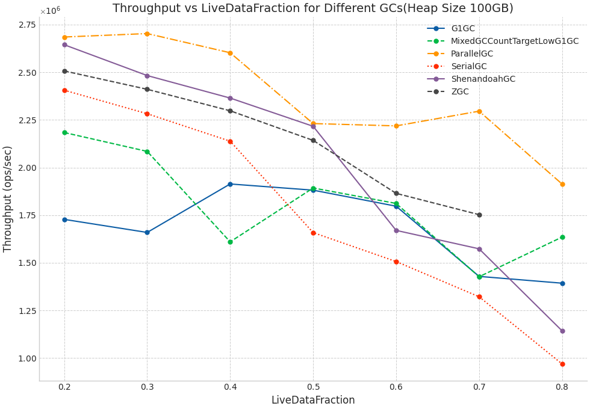
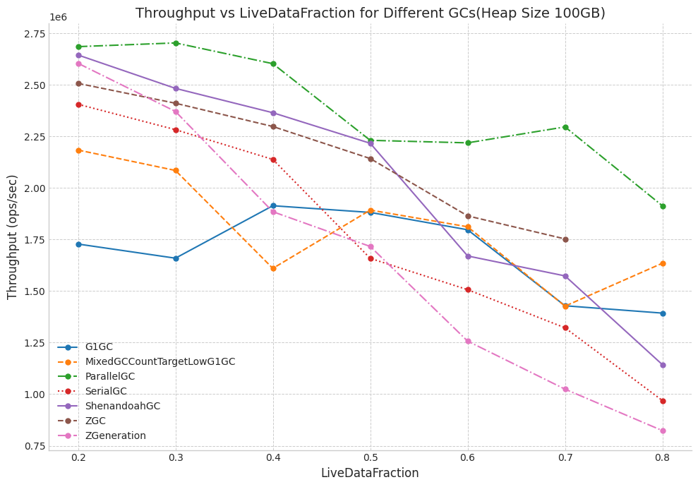
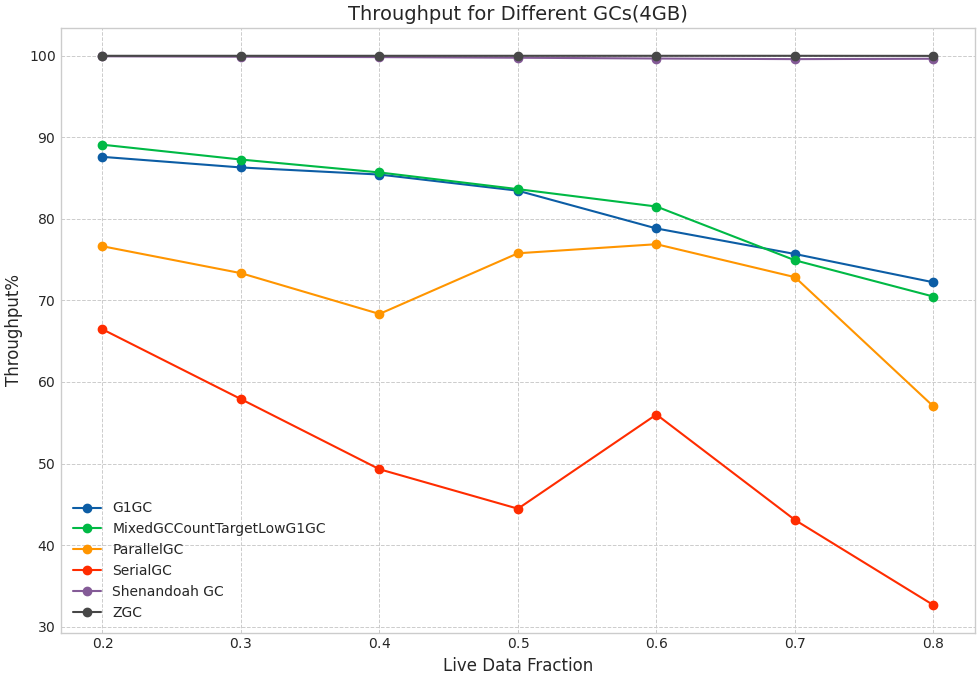
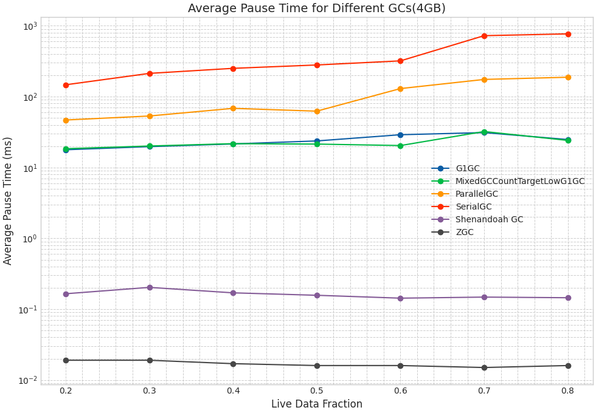
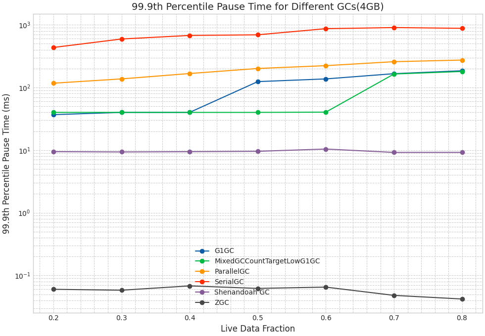

# Java GC 初探

## 一. 任务
写一个测试用例，通过不同的GC参数（Serial GC，Parallel Scavenge，G1GC，ZGC，Shenandoah GC），通过打印GC日志完整的展示GC的各个阶段 (比如，统一的 –Xmx –Xms)
展示：

GC暂停时间，测试完成时间，GC吞吐率。


## 二，编译JDK

```shell
git clone https://github.com/Tencent/TencentKona-17 -b TencentKona-17.0.11
cd TencentKona-17
bash configure
make images
```
输出如下：


`java -version`查看版本：



如需要修改编译参数，如关闭shenandoahgc，可以使用`bash configure --with-jvm-features=-shenandoahgc`等参数进行编译：


## 三. Benchmark

通过LinkedHashMap模拟LRU算法，通过JMH进行随机访问测试。

部分设定：
1. 4GB 与 100GB Heap Size
2. 12个Thread(处理器为AMD EPYC 7Y43，开启超线程。即6个物理核心，在同一个CCD上)
3. 60s warmup，60s 测试时间， 5 iterations
4. 0.2, 0.3, 0.4, 0.5, 0.6, 0.7, 0.8的liveDataFraction
5. 测试Serial GC，Parallel Scavenge，G1GC，ZGC，Shenandoah GC

例如：
```shell
numactl -C 0-11 -m 0  java -Xms4G -Xmx4G -XX:ActiveProcessorCount=12 -jar ../GCBench.jar -rf json -rff result.json -p liveDataFraction=0.2,0.3,0.4,0.5,0.6,0.7,0.8 -w 60s -r 60s
```

备注： 暂未开启JMH gc profiler进行测试，后续补充。

## 四. GC阶段分析
该章节主要根据GC日志，了解不同GC的各个阶段。
### 1. Serial GC
以该[Serial GC GC日志](log/4G/gc_log_SerialGC_2024-08-21_14-06-45_1382775.log)为例

特点：
1. 串行GC，只有一个GC线程，GC过程中会暂停所有应用线程
2. 适用于单核机器或小内存机器
3. footprint小
<details>
<summary>Minor GC</summary>

```
[0.760s][info][gc,start    ] GC(0) Pause Young (Allocation Failure)
[1.475s][info][gc,heap     ] GC(0) DefNew: 1118528K(1258304K)->139776K(1258304K) Eden: 1118528K(1118528K)->0K(1118528K) From: 0K(139776K)->139776K(139776K)
[1.475s][info][gc,heap     ] GC(0) Tenured: 0K(2796224K)->908740K(2796224K)
[1.475s][info][gc,metaspace] GC(0) Metaspace: 10443K(10688K)->10443K(10688K) NonClass: 9424K(9536K)->9424K(9536K) Class: 1019K(1152K)->1019K(1152K)
[1.475s][info][gc          ] GC(0) Pause Young (Allocation Failure) 1092M->1023M(3959M) 714.884ms
[1.475s][info][gc,cpu      ] GC(0) User=0.24s Sys=0.48s Real=0.72s
```
本次触发原因是内存分配失败（Allocation Failure）。GC后，Eden区被清空，一些对象被提升到了From区和老年代。整个GC过程耗时约714毫秒，CPU时间占用了0.72秒。
</details>

<details>
<summary>Full GC</summary>

```
[2.702s][info][gc,start    ] GC(3) Pause Full (Allocation Failure)
[2.702s][info][gc,phases,start] GC(3) Phase 1: Mark live objects
[2.858s][info][gc,phases      ] GC(3) Phase 1: Mark live objects 155.932ms
[2.858s][info][gc,phases,start] GC(3) Phase 2: Compute new object addresses
[2.973s][info][gc,phases      ] GC(3) Phase 2: Compute new object addresses 115.578ms
[2.973s][info][gc,phases,start] GC(3) Phase 3: Adjust pointers
[3.136s][info][gc,phases      ] GC(3) Phase 3: Adjust pointers 162.494ms
[3.136s][info][gc,phases,start] GC(3) Phase 4: Move objects
[3.598s][info][gc,phases      ] GC(3) Phase 4: Move objects 462.479ms
[3.599s][info][gc,heap        ] GC(3) DefNew: 1258303K(1258304K)->463137K(1258304K) Eden: 1118528K(1118528K)->463137K(1118528K) From: 139775K(139776K)->0K(139776K)
[3.599s][info][gc,heap        ] GC(3) Tenured: 2019409K(2796224K)->2796220K(2796224K)
[3.599s][info][gc,metaspace   ] GC(3) Metaspace: 10443K(10688K)->10443K(10688K) NonClass: 9424K(9536K)->9424K(9536K) Class: 1019K(1152K)->1019K(1152K)
[3.599s][info][gc             ] GC(3) Pause Full (Allocation Failure) 3200M->3182M(3959M) 897.273ms
[3.599s][info][gc,cpu         ] GC(3) User=0.53s Sys=0.37s Real=0.90s
```
主要分为四个阶段：
1. Mark live objects：标记存活对象(155.932ms)
2. Compute new object addresses：计算新对象地址(115.578ms)
3. Adjust pointers：调整指针(162.494ms)
4. Move objects：移动对象(462.479ms)
   
整个过程共耗时约897毫秒，其中大部分时间花费在对象移动阶段。
</details>

### 2. Parallel Scavenge
以该[Parallel Scavenge GC日志](log/4G/gc_log_ParallelGC_2024-08-21_12-46-28_1382431.log)为例

特点：
1. 在GC期间, 所有 CPU 内核都在并行清理垃圾, 所以暂停时间更短
2. 在两次GC周期的间隔期, 没有GC线程在运行,不会消耗任何系统资源
3. 达到可控制的吞吐量

<details>
<summary>Parallel Workers</summary>

因为我们通过numactl和-XX:ActiveProcessorCount=12指定了线程数为12，所以可以看到初始化时配置了10个并行工作线程用于垃圾回收。

```
[0.010s][info][gc,init] Parallel Workers: 10
```
> 计算公式：
> ```
> if (num of processors <=8) {
>   return num of processors; 
> } else {
>   return 8+(num of processors-8)*(5/8);
> }
> ```


</details>

<details>
<SUMMARY> Young GC </SUMMARY>

```
[0.723s][info][gc,start    ] GC(0) Pause Young (Allocation Failure)
[0.912s][info][gc,heap     ] GC(0) PSYoungGen: 1048576K(1223168K)->174588K(1223168K) Eden: 1048576K(1048576K)->0K(1048576K) From: 0K(174592K)->174588K(174592K)
[0.912s][info][gc,heap     ] GC(0) ParOldGen: 0K(2796544K)->826897K(2796544K)
[0.912s][info][gc,metaspace] GC(0) Metaspace: 10446K(10688K)->10446K(10688K) NonClass: 9427K(9536K)->9427K(9536K) Class: 1019K(1152K)->1019K(1152K)
[0.912s][info][gc          ] GC(0) Pause Young (Allocation Failure) 1024M->978M(3925M) 189.186ms
[0.912s][info][gc,cpu      ] GC(0) User=0.29s Sys=1.37s Real=0.18s
```

本次触发原因是内存分配失败（Allocation Failure）。GC后，Eden区被清空，一些对象被提升到了From区和老年代。整个GC过程耗时约189毫秒。

另外可以看到Real为0.18秒，而User为0.29秒，Sys为1.37秒，User和System相加与Real相加接近10倍。这是因为在Parallel Scavenge GC中使用了10个Worker。

</details>

<details>
<summary>Full GC</summary>

```
[1.282s][info][gc,start    ] GC(2) Pause Full (Ergonomics)
[1.282s][info][gc,phases,start] GC(2) Marking Phase
[1.319s][info][gc,phases      ] GC(2) Marking Phase 37.032ms
[1.319s][info][gc,phases,start] GC(2) Summary Phase
[1.319s][info][gc,phases      ] GC(2) Summary Phase 0.063ms
[1.319s][info][gc,phases,start] GC(2) Adjust Roots
[1.320s][info][gc,phases      ] GC(2) Adjust Roots 0.473ms
[1.320s][info][gc,phases,start] GC(2) Compaction Phase
[1.451s][info][gc,phases      ] GC(2) Compaction Phase 130.883ms
[1.451s][info][gc,phases,start] GC(2) Post Compact
[1.456s][info][gc,phases      ] GC(2) Post Compact 5.576ms
[1.456s][info][gc,heap        ] GC(2) PSYoungGen: 174574K(1223168K)->0K(1223168K) Eden: 0K(1048576K)->0K(1048576K) From: 174574K(174592K)->0K(174592K)
[1.456s][info][gc,heap        ] GC(2) ParOldGen: 1867966K(2796544K)->2023627K(2796544K)
[1.456s][info][gc,metaspace   ] GC(2) Metaspace: 10447K(10688K)->10447K(10688K) NonClass: 9428K(9536K)->9428K(9536K) Class: 1019K(1152K)->1019K(1152K)
[1.456s][info][gc             ] GC(2) Pause Full (Ergonomics) 1994M->1976M(3925M) 174.257ms
[1.456s][info][gc,cpu         ] GC(2) User=0.78s Sys=0.30s Real=0.17s
```

本次触发原因是Ergonomics，通常发生在如果老生代的剩余空间少于下一次收集所需的剩余空间，那么现在就做一个完整的收集，可参考[该文章](https://cloud.tencent.com/developer/article/1082687)。 


1. Marking Phase：标记阶段,GC开始标记存活的对象(37.032ms)
2. Summary Phase：总结阶段,GC总结标记过程中的数据,耗时极短(0.063ms)
3. Adjust Roots：调整根节点，GC调整指向根对象的引用，确保根对象指向的内容被正确标记(0.473ms)
4. Compaction Phase：压缩阶段，GC对存活对象进行压缩，以减少碎片并整理堆空间(130.883ms)
5. Post Compact：压缩后处理(5.576ms)
6. 整个过程共耗时约174毫秒，其中大部分时间花费在压缩阶段。

</details>

### 3. G1GC
以该[G1GC GC日志](log/4G/gc_log_G1_2024-08-21_10-26-16_1379281.log)为例

特点：
1. 引入了面向局部收集的思路和基于Region的内存布局
2. 优先收集那些回收价值最大的Region
3. 面向Server端的应用，作为CMS的替代者
4. Pre-Write Barrier： SATB       
5. Post-write Barrier: Remembered Set
<details>
<summary>Young GC</summary>

```
[0.371s][info][gc,start    ] GC(0) Pause Young (Normal) (G1 Evacuation Pause)
[0.373s][info][gc,task     ] GC(0) Using 10 workers of 10 for evacuation
[0.415s][info][gc,phases   ] GC(0)   Pre Evacuate Collection Set: 0.3ms
[0.415s][info][gc,phases   ] GC(0)   Merge Heap Roots: 0.2ms
[0.415s][info][gc,phases   ] GC(0)   Evacuate Collection Set: 41.2ms
[0.415s][info][gc,phases   ] GC(0)   Post Evacuate Collection Set: 0.3ms
[0.415s][info][gc,phases   ] GC(0)   Other: 1.4ms
[0.415s][info][gc,heap     ] GC(0) Eden regions: 102->0(89)
[0.415s][info][gc,heap     ] GC(0) Survivor regions: 0->13(13)
[0.415s][info][gc,heap     ] GC(0) Old regions: 0->84
[0.415s][info][gc,heap     ] GC(0) Archive regions: 0->0
[0.415s][info][gc,heap     ] GC(0) Humongous regions: 3->3
[0.415s][info][gc,metaspace] GC(0) Metaspace: 10439K(10688K)->10439K(10688K) NonClass: 9420K(9536K)->9420K(9536K) Class: 1019K(1152K)->1019K(1152K)
[0.415s][info][gc          ] GC(0) Pause Young (Normal) (G1 Evacuation Pause) 210M->198M(4096M) 43.488ms
[0.415s][info][gc,cpu      ] GC(0) User=0.07s Sys=0.33s Real=0.04s
```

该新生代GC清空了Eden区，将存活对象提升到Survivor区和老年代。整个GC过程耗时约43毫秒。

</details>

<details>
<summary>并发标记</summary>

```
[0.906s][info][gc,start    ] GC(11) Pause Young (Concurrent Start) (G1 Evacuation Pause)
```
该阶段利用Young gc的机会来trace所有对象，设置了两个TAMS（top-at-mark-start）变量，用来区分存活的对象和在并发标记阶段新分配的对象。

```
[0.925s][info][gc          ] GC(12) Concurrent Mark Cycle
[0.925s][info][gc,marking  ] GC(12) Concurrent Clear Claimed Marks
[0.925s][info][gc,marking  ] GC(12) Concurrent Clear Claimed Marks 0.023ms
[0.925s][info][gc,marking  ] GC(12) Concurrent Scan Root Regions
[0.946s][info][gc,marking  ] GC(12) Concurrent Scan Root Regions 21.121ms
[0.946s][info][gc,marking  ] GC(12) Concurrent Mark
[0.946s][info][gc,marking  ] GC(12) Concurrent Mark From Roots
[0.946s][info][gc,task     ] GC(12) Using 3 workers of 3 for marking
[1.002s][info][gc,marking  ] GC(12) Concurrent Mark From Roots 56.360ms
[1.002s][info][gc,marking  ] GC(12) Concurrent Preclean
[1.003s][info][gc,marking  ] GC(12) Concurrent Preclean 0.125ms
[1.003s][info][gc,start    ] GC(12) Pause Remark
[1.003s][info][gc          ] GC(12) Pause Remark 2379M->2379M(4096M) 0.549ms
[1.003s][info][gc,cpu      ] GC(12) User=0.00s Sys=0.00s Real=0.00s
[1.003s][info][gc,marking  ] GC(12) Concurrent Mark 57.230ms
[1.003s][info][gc,marking  ] GC(12) Concurrent Rebuild Remembered Sets
············
[1.055s][info][gc,marking  ] GC(12) Concurrent Rebuild Remembered Sets 51.577ms
[1.055s][info][gc,start    ] GC(12) Pause Cleanup
[1.055s][info][gc          ] GC(12) Pause Cleanup 2470M->2470M(4096M) 0.193ms
[1.055s][info][gc,cpu      ] GC(12) User=0.00s Sys=0.00s Real=0.00s
[1.055s][info][gc,marking  ] GC(12) Concurrent Cleanup for Next Mark
[1.066s][info][gc,marking  ] GC(12) Concurrent Cleanup for Next Mark 10.205ms
[1.066s][info][gc          ] GC(12) Concurrent Mark Cycle 140.638ms
```

该阶段主要分为以下几个部分：
1. Concurrent Clear Claimed Marks：清除标记
2. Concurrent Scan Root Regions：扫描根区域

在根区域扫描完成后，开始并发标记，这完全是在后台线程中进行的，不会暂停应用程序。
3. Concurrent Mark：并发标记
4. Concurrent Preclean：并发预清理

随后暂停应用程序，进行Remark和cleanup操作，不过暂停时间很短。
5. Pause Remark：暂停标记
6. Concurrent Rebuild Remembered Sets：重建Remembered Sets
7. Pause Cleanup：暂停清理
8. Concurrent Cleanup for Next Mark：下一个标记的并发清理


</details>

<details>
<summary>Mixed GC</summary>

```
[1.092s][info][gc,start    ] GC(14) Pause Young (Prepare Mixed) (G1 Evacuation Pause)
[1.092s][info][gc,task     ] GC(14) Using 10 workers of 10 for evacuation
[1.112s][info][gc,phases   ] GC(14)   Pre Evacuate Collection Set: 0.1ms
[1.112s][info][gc,phases   ] GC(14)   Merge Heap Roots: 0.7ms
[1.112s][info][gc,phases   ] GC(14)   Evacuate Collection Set: 18.3ms
[1.112s][info][gc,phases   ] GC(14)   Post Evacuate Collection Set: 0.3ms
[1.112s][info][gc,phases   ] GC(14)   Other: 0.1ms
[1.112s][info][gc,heap     ] GC(14) Eden regions: 89->0(89)
[1.112s][info][gc,heap     ] GC(14) Survivor regions: 13->13(13)
[1.112s][info][gc,heap     ] GC(14) Old regions: 1176->1266
[1.112s][info][gc,heap     ] GC(14) Archive regions: 0->0
[1.112s][info][gc,heap     ] GC(14) Humongous regions: 3->3
[1.112s][info][gc,metaspace] GC(14) Metaspace: 10441K(10688K)->10441K(10688K) NonClass: 9422K(9536K)->9422K(9536K) Class: 1019K(1152K)->1019K(1152K)
[1.112s][info][gc          ] GC(14) Pause Young (Prepare Mixed) (G1 Evacuation Pause) 2562M->2564M(4096M) 19.601ms
[1.112s][info][gc,cpu      ] GC(14) User=0.09s Sys=0.09s Real=0.02s
```

首次Mixed GC被标记为Prepare Mixed。Mixed GC将持续多次，知道（几乎）所有标记的区域都被回收。如GC(15)是第二次Mixed GC。

```
[1.194s][info][gc,start    ] GC(15) Pause Young (Mixed) (G1 Evacuation Pause)
[1.194s][info][gc,task     ] GC(15) Using 10 workers of 10 for evacuation
[1.214s][info][gc,phases   ] GC(15)   Pre Evacuate Collection Set: 0.1ms
[1.214s][info][gc,phases   ] GC(15)   Merge Heap Roots: 0.8ms
[1.214s][info][gc,phases   ] GC(15)   Evacuate Collection Set: 18.8ms
[1.214s][info][gc,phases   ] GC(15)   Post Evacuate Collection Set: 0.4ms
[1.214s][info][gc,phases   ] GC(15)   Other: 0.1ms
[1.214s][info][gc,heap     ] GC(15) Eden regions: 89->0(126)
[1.214s][info][gc,heap     ] GC(15) Survivor regions: 13->13(13)
[1.214s][info][gc,heap     ] GC(15) Old regions: 1266->1353
[1.214s][info][gc,heap     ] GC(15) Archive regions: 0->0
[1.214s][info][gc,heap     ] GC(15) Humongous regions: 3->3
[1.214s][info][gc,metaspace] GC(15) Metaspace: 10441K(10688K)->10441K(10688K) NonClass: 9422K(9536K)->9422K(9536K) Class: 1019K(1152K)->1019K(1152K)
[1.214s][info][gc          ] GC(15) Pause Young (Mixed) (G1 Evacuation Pause) 2742M->2737M(4096M) 20.297ms
[1.214s][info][gc,cpu      ] GC(15) User=0.05s Sys=0.15s Real=0.02s
```

</details>

<details>
<summary>Full GC</summary>

晋升失败（Promotion failure)是指在Mixed GC过程中，在没有清理足够空间之前，有太多的对象从新生代晋升，导致老年代空间还是用完了，在GC log中提示To-space exhausted，随后紧跟着Full gc


```
[2.563s][info][gc,start    ] GC(24) Pause Young (Mixed) (G1 Preventive Collection)
[2.563s][info][gc,task     ] GC(24) Using 10 workers of 10 for evacuation
[2.581s][info][gc          ] GC(24) To-space exhausted
[2.581s][info][gc,phases   ] GC(24)   Pre Evacuate Collection Set: 0.1ms
[2.581s][info][gc,phases   ] GC(24)   Merge Heap Roots: 1.6ms
[2.581s][info][gc,phases   ] GC(24)   Evacuate Collection Set: 13.5ms
[2.581s][info][gc,phases   ] GC(24)   Post Evacuate Collection Set: 2.1ms
[2.581s][info][gc,phases   ] GC(24)   Other: 0.2ms
[2.581s][info][gc,heap     ] GC(24) Eden regions: 26->0(89)
[2.581s][info][gc,heap     ] GC(24) Survivor regions: 13->13(13)
[2.581s][info][gc,heap     ] GC(24) Old regions: 1924->2032
[2.581s][info][gc,heap     ] GC(24) Archive regions: 0->0
[2.581s][info][gc,heap     ] GC(24) Humongous regions: 3->3
[2.581s][info][gc,metaspace] GC(24) Metaspace: 10441K(10688K)->10441K(10688K) NonClass: 9422K(9536K)->9422K(9536K) Class: 1019K(1152K)->1019K(1152K)
[2.581s][info][gc          ] GC(24) Pause Young (Mixed) (G1 Preventive Collection) 3932M->4096M(4096M) 17.656ms
[2.581s][info][gc,cpu      ] GC(24) User=0.17s Sys=0.00s Real=0.02s
[2.581s][info][gc,ergo     ] Attempting full compaction
[2.581s][info][gc,task     ] GC(25) Using 10 workers of 10 for full compaction
[2.581s][info][gc,start    ] GC(25) Pause Full (G1 Compaction Pause)
[2.581s][info][gc,phases,start] GC(25) Phase 1: Mark live objects
[2.602s][info][gc,phases      ] GC(25) Phase 1: Mark live objects 20.825ms
[2.602s][info][gc,phases,start] GC(25) Phase 2: Prepare for compaction
[2.612s][info][gc,phases      ] GC(25) Phase 2: Prepare for compaction 9.899ms
[2.612s][info][gc,phases,start] GC(25) Phase 3: Adjust pointers
[2.628s][info][gc,phases      ] GC(25) Phase 3: Adjust pointers 16.183ms
[2.628s][info][gc,phases,start] GC(25) Phase 4: Compact heap
[2.708s][info][gc,phases      ] GC(25) Phase 4: Compact heap 79.751ms
[2.710s][info][gc,heap        ] GC(25) Eden regions: 0->0(118)
[2.710s][info][gc,heap        ] GC(25) Survivor regions: 13->0(13)
[2.710s][info][gc,heap        ] GC(25) Old regions: 2032->1468
[2.710s][info][gc,heap        ] GC(25) Archive regions: 0->0
[2.710s][info][gc,heap        ] GC(25) Humongous regions: 3->3
[2.710s][info][gc,metaspace   ] GC(25) Metaspace: 10441K(10688K)->10421K(10688K) NonClass: 9422K(9536K)->9406K(9536K) Class: 1019K(1152K)->1014K(1152K)
[2.710s][info][gc             ] GC(25) Pause Full (G1 Compaction Pause) 4096M->2930M(4096M) 128.723ms
[2.710s][info][gc,cpu         ] GC(25) User=1.11s Sys=0.03s Real=0.12s
```

</details>


### 4. ZGC
以该[ZGC GC日志](log/4G/gc_log_ZGC_2024-08-21_16-17-09_1389920.log)为例

特点：
1. 低延迟
2. 基于Region的内存布局
3. 读屏障，染色指针，内存多重映射
4. 并发的标记-整理算法

<details>

一次完整的GC日志如下：
```
[265.784s][info][gc,start    ] GC(866) Garbage Collection (Allocation Rate)
[265.784s][info][gc,task     ] GC(866) Using 3 workers
[265.784s][info][gc,phases   ] GC(866) Pause Mark Start 0.017ms
[265.955s][info][gc,phases   ] GC(866) Concurrent Mark 170.768ms
[265.955s][info][gc,phases   ] GC(866) Pause Mark End 0.021ms
[265.955s][info][gc,phases   ] GC(866) Concurrent Mark Free 0.001ms
[265.956s][info][gc,phases   ] GC(866) Concurrent Process Non-Strong References 0.607ms
[265.956s][info][gc,phases   ] GC(866) Concurrent Reset Relocation Set 0.022ms
[265.957s][info][gc,phases   ] GC(866) Concurrent Select Relocation Set 1.554ms
[265.957s][info][gc,phases   ] GC(866) Pause Relocate Start 0.004ms
[265.985s][info][gc,phases   ] GC(866) Concurrent Relocate 27.171ms
[265.985s][info][gc,load     ] GC(866) Load: 2.98/2.57/2.10
[265.985s][info][gc,mmu      ] GC(866) MMU: 2ms/97.2%, 5ms/98.9%, 10ms/99.4%, 20ms/99.7%, 50ms/99.9%, 100ms/99.9%
[265.985s][info][gc,marking  ] GC(866) Mark: 2 stripe(s), 10 proactive flush(es), 2 terminate flush(es), 0 completion(s), 0 continuation(s) 
[265.985s][info][gc,marking  ] GC(866) Mark Stack Usage: 32M
[265.985s][info][gc,nmethod  ] GC(866) NMethods: 915 registered, 0 unregistered
[265.985s][info][gc,metaspace] GC(866) Metaspace: 10M used, 10M committed, 1088M reserved
[265.985s][info][gc,ref      ] GC(866) Soft: 346 encountered, 0 discovered, 0 enqueued
[265.985s][info][gc,ref      ] GC(866) Weak: 563 encountered, 194 discovered, 0 enqueued
[265.985s][info][gc,ref      ] GC(866) Final: 0 encountered, 0 discovered, 0 enqueued
[265.985s][info][gc,ref      ] GC(866) Phantom: 9 encountered, 6 discovered, 0 enqueued
[265.985s][info][gc,reloc    ] GC(866) Small Pages: 1880 / 3760M, Empty: 0M, Relocated: 481M, In-Place: 0
[265.985s][info][gc,reloc    ] GC(866) Medium Pages: 0 / 0M, Empty: 0M, Relocated: 0M, In-Place: 0
[265.985s][info][gc,reloc    ] GC(866) Large Pages: 1 / 10M, Empty: 0M, Relocated: 0M, In-Place: 0
[265.985s][info][gc,reloc    ] GC(866) Forwarding Usage: 6M
[265.985s][info][gc,heap     ] GC(866) Min Capacity: 4096M(100%)
[265.985s][info][gc,heap     ] GC(866) Max Capacity: 4096M(100%)
[265.985s][info][gc,heap     ] GC(866) Soft Max Capacity: 4096M(100%)
[265.985s][info][gc,heap     ] GC(866)                Mark Start          Mark End        Relocate Start      Relocate End           High               Low         
[265.985s][info][gc,heap     ] GC(866)  Capacity:     4096M (100%)       4096M (100%)       4096M (100%)       4096M (100%)       4096M (100%)       4096M (100%)   
[265.985s][info][gc,heap     ] GC(866)      Free:      326M (8%)          162M (4%)          158M (4%)          442M (11%)         442M (11%)         152M (4%)     
[265.985s][info][gc,heap     ] GC(866)      Used:     3770M (92%)        3934M (96%)        3938M (96%)        3654M (89%)        3944M (96%)        3654M (89%)    
[265.985s][info][gc,heap     ] GC(866)      Live:         -              2941M (72%)        2941M (72%)        2941M (72%)            -                  -          
[265.985s][info][gc,heap     ] GC(866) Allocated:         -               164M (4%)          168M (4%)          185M (5%)             -                  -          
[265.985s][info][gc,heap     ] GC(866)   Garbage:         -               828M (20%)         828M (20%)         527M (13%)            -                  -          
[265.985s][info][gc,heap     ] GC(866) Reclaimed:         -                  -                 0M (0%)          301M (7%)             -                  -          
[265.985s][info][gc          ] GC(866) Garbage Collection (Allocation Rate) 3770M(92%)->3654M(89%)
[266.084s][info][gc,start    ] GC(867) Garbage Collection (Allocation Rate)
```

其中包含了以下信息：
1. GCStart：开始GC，并标明的GC触发的原因。上图中触发原因是自适应算法。
2. Pause Mark Start：初始标记，存在STW
3. Pause Mark End：标记结束，存在STW
4. Pause Relocate Start：重定位开始，存在STW
5. 最后输出了堆的使用情况

</details>

### 5. Shenandoah

以该[Shenandoah GC日志](log/4G/gc_log_Shenandoah_2024-08-21_15-06-52_1387544.log.0)为例

特点：
1. 低延迟
2. 使用连接矩阵代替G1的Remembered Set
3. 并发的标记-整理算法
4. 默认不分代

<details>


```
[0.752s][info][gc,start    ] GC(0) Concurrent reset
[0.753s][info][gc,task     ] GC(0) Using 3 of 6 workers for concurrent reset
[0.753s][info][gc,ergo     ] GC(0) Pacer for Reset. Non-Taxable: 4096M
[0.753s][info][gc          ] GC(0) Concurrent reset 0.463ms
[0.753s][info][gc,start    ] GC(0) Pause Init Mark (unload classes)
[0.754s][info][gc,task     ] GC(0) Using 6 of 6 workers for init marking
[0.754s][info][gc,ergo     ] GC(0) Pacer for Mark. Expected Live: 409M, Free: 2862M, Non-Taxable: 286M, Alloc Tax Rate: 0.2x
[0.754s][info][gc          ] GC(0) Pause Init Mark (unload classes) 0.480ms
[0.754s][info][gc,start    ] GC(0) Concurrent marking roots
[0.754s][info][gc,task     ] GC(0) Using 3 of 6 workers for concurrent marking roots
[0.754s][info][gc          ] GC(0) Concurrent marking roots 0.457ms
[0.754s][info][gc,start    ] GC(0) Concurrent marking (unload classes)
[0.754s][info][gc,task     ] GC(0) Using 3 of 6 workers for concurrent marking
[0.801s][info][gc          ] GC(0) Concurrent marking (unload classes) 46.425ms
[0.801s][info][gc,start    ] GC(0) Pause Final Mark (unload classes)
[0.801s][info][gc,task     ] GC(0) Using 6 of 6 workers for final marking
[0.801s][info][gc,ergo     ] GC(0) Adaptive CSet Selection. Target Free: 580M, Actual Free: 2998M, Max CSet: 170M, Min Garbage: 0B
[0.801s][info][gc,ergo     ] GC(0) Collectable Garbage: 14342K (69%), Immediate: 0B (0%), CSet: 14342K (69%)
[0.801s][info][gc,ergo     ] GC(0) Pacer for Evacuation. Used CSet: 16384K, Free: 2792M, Non-Taxable: 279M, Alloc Tax Rate: 1.1x
[0.801s][info][gc          ] GC(0) Pause Final Mark (unload classes) 0.160ms
[0.801s][info][gc,start    ] GC(0) Concurrent thread roots
[0.801s][info][gc,task     ] GC(0) Using 3 of 6 workers for Concurrent thread roots
[0.801s][info][gc          ] GC(0) Concurrent thread roots 0.304ms
[0.801s][info][gc,start    ] GC(0) Concurrent weak references
[0.801s][info][gc,task     ] GC(0) Using 3 of 6 workers for concurrent weak references
[0.801s][info][gc,ref      ] GC(0) Encountered references: Soft: 314, Weak: 635, Final: 0, Phantom: 66
[0.801s][info][gc,ref      ] GC(0) Discovered  references: Soft: 0, Weak: 284, Final: 0, Phantom: 62
[0.801s][info][gc,ref      ] GC(0) Enqueued    references: Soft: 0, Weak: 126, Final: 0, Phantom: 57
[0.802s][info][gc          ] GC(0) Concurrent weak references 0.171ms
[0.802s][info][gc,start    ] GC(0) Concurrent weak roots
[0.802s][info][gc,task     ] GC(0) Using 3 of 6 workers for concurrent weak root
[0.802s][info][gc          ] GC(0) Concurrent weak roots 0.249ms
[0.802s][info][gc,start    ] GC(0) Concurrent cleanup
[0.802s][info][gc          ] GC(0) Concurrent cleanup 1097M->1097M(4096M) 0.046ms
[0.802s][info][gc,ergo     ] GC(0) Free: 2790M, Max: 2048K regular, 2790M humongous, Frag: 0% external, 0% internal; Reserve: 205M, Max: 2048K
[0.802s][info][gc,start    ] GC(0) Concurrent class unloading
[0.802s][info][gc,task     ] GC(0) Using 3 of 6 workers for concurrent class unloading
[0.802s][info][gc          ] GC(0) Concurrent class unloading 0.484ms
[0.802s][info][gc,start    ] GC(0) Concurrent strong roots
[0.802s][info][gc,task     ] GC(0) Using 3 of 6 workers for concurrent strong root
[0.803s][info][gc          ] GC(0) Concurrent strong roots 0.306ms
[0.803s][info][gc,start    ] GC(0) Concurrent evacuation
[0.803s][info][gc,task     ] GC(0) Using 3 of 6 workers for concurrent evacuation
[0.804s][info][gc          ] GC(0) Concurrent evacuation 0.868ms
[0.804s][info][gc,start    ] GC(0) Pause Init Update Refs
[0.804s][info][gc,ergo     ] GC(0) Pacer for Update Refs. Used: 1104M, Free: 2786M, Non-Taxable: 278M, Alloc Tax Rate: 1.1x
[0.804s][info][gc          ] GC(0) Pause Init Update Refs 0.025ms
[0.804s][info][gc,start    ] GC(0) Concurrent update references
[0.804s][info][gc,task     ] GC(0) Using 3 of 6 workers for concurrent reference update
[0.811s][info][gc          ] GC(0) Concurrent update references 7.208ms
[0.811s][info][gc,start    ] GC(0) Concurrent update thread roots
[0.811s][info][gc          ] GC(0) Concurrent update thread roots 0.272ms
[0.811s][info][gc,start    ] GC(0) Pause Final Update Refs
[0.811s][info][gc,task     ] GC(0) Using 6 of 6 workers for final reference update
[0.811s][info][gc          ] GC(0) Pause Final Update Refs 0.062ms
[0.811s][info][gc,start    ] GC(0) Concurrent cleanup
[0.811s][info][gc          ] GC(0) Concurrent cleanup 1118M->1102M(4096M) 0.046ms
[0.811s][info][gc,ergo     ] Free: 2785M, Max: 2048K regular, 2768M humongous, Frag: 1% external, 0% internal; Reserve: 206M, Max: 2048K
```

Shenandoah 可以分为以下几个阶段：
1. Initial Mark：初始标记，存在STW
2. Concurrent Mark：并发标记
3. Final Mark：最终标记，存在STW
4. Concurrent Evacuation：并发回收
5. Initial Update Refs：初始更新引用
6. Concurrent Update Refs：并发更新引用
7. Final Update Refs：最终更新引用
8. Concurrent Cleanup:并发清理

</details>


## 五、Benchmark结果分析

### 1。LRU吞吐量

我们通过JMH测试了不同GC在不同 Live Data Fraction下的LRU吞吐量，结果如下：




可以看到，随着Live Data Fraction的上升，逐渐提升了对GC的压力，导致吞吐量逐渐下降。

其中**Parallel GC**作为关注吞吐量的GC算法，在两种堆内存大小下均有最佳的性能。

同时，我们在G1GC的基础上，考虑调整MixedGCCountTarget=4(任务3相关)作为对比。该值影响Mixed GC周期的最大总次数，减小该值有助于缓解晋升失败的问题，但代价是Mixed GC周期的停顿时间更长。从图中可以看出，在LRU场景中，降低该值能够在多数情况下提升吞吐量。

另外，从图中可以看到ZGC、Shenandoah GC这类低延迟GC在高负载的情况下显示了严重的吞吐量下降(在Live Data Fraction=0.2时，性能接近Parallel GC，但在Live Data Fraction=0.7时，性能下降明显，与Serial GC接近)。

特别的，ZGC在Live Data Fraction=0.8时发生了Out Of Memory。一种猜测是ZGC无法使用压缩指针，但由于100GB仍发生相同问题，我猜测由于LRU Benchmark分配速率较高，这些新对象难以进入当此收集的标记范围，导致产生大量浮动垃圾，最终导致OOM。

一种最简单的解决方案是增加堆内存大小，但这并不是一个通用的解决方案。另一种方案是使用分代GC,进行更频繁、快速的新生代GC。因为我们使用JDK版本为17，还不支持分代ZGC，这里我们使用OpenJDK 22.0.1进行额外的测试，结果如下：


可以看到，引入分代GC后，ZGC在高负载下的能够正常运行，但同时由于分代GC在LRU场景下的不适应导致性能相对较差。

### 2. 暂停时间与GC吞吐量

我们提取了4GB堆内存下的Parallel GC、G1 GC、ZGC、Shenandoah GC的暂停时间与GC吞吐量的数据，结果如下：



其中ZGC和Shenandoah 的 Throughput是稳定在99%以上的。另外串行GC的暂停时间最长，吞吐量最低。同时也注意到，虽然Parallel GC的STW时间较长，但是实际LRU的吞吐量是最高的。



最后通过平均和P99.9的暂停时间来看，可以看到，ZGC、Shenandoah GC的暂停时间低于其他GC数个数量级，同时ZGC的暂停时间也相对于Shenandoah GC更低。

